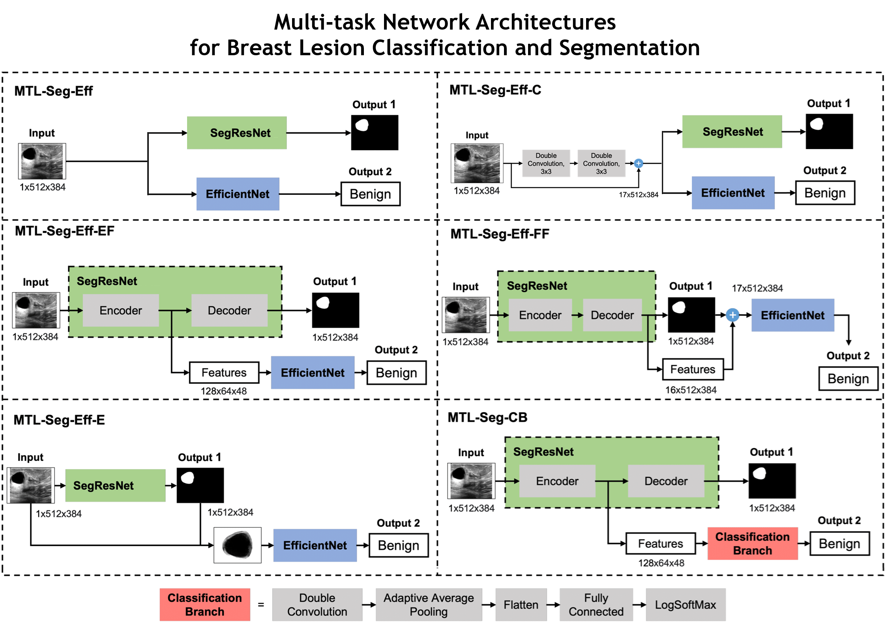

# Evaluating Multi-Task Network Architectures for Simultaneous Breast Lesion Segmentation and Classification in Ultrasound Images

Breast lesion segmentation and classification in ultrasound (US) images are two essential tasks for computer-aided diagnosis of breast cancer. However, these tasks are still challenging, mainly due to the high variability of lesions and the poor image quality of US. Numerous deep learning methods have been proposed to assist physicians in performing breast lesion segmentation and classification. Considering that these tasks are related to common features, learning them jointly through multi-task learning (MTL) represents a viable approach to improve the performance of each individual task. In this work, we present and compare multiple MTL network configurations for the simultaneous segmentation and classification of breast lesions in ultrasound images. Building on two state-of-the-art architectures, namely SegResNet for segmentation and EfficientNet for classification, we designed and evaluated several combined configurations of these models arranged in different MTL schemes. These configurations explore various levels of feature sharing and integration between the tasks, aiming to identify the most effective architectural arrangement for joint lesion segmentation and malignancy classification in breast ultrasound. 

## MTL Networks

